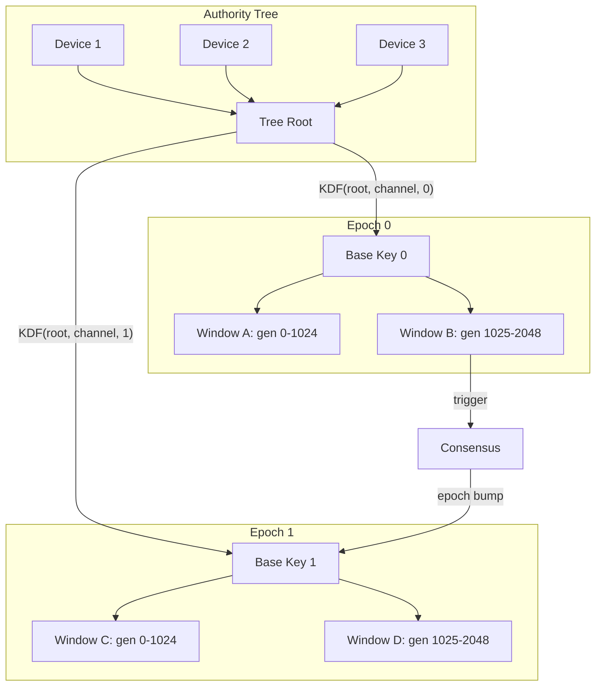

+++
title = "Patterns for P2P Resilience: Learnings from Aura Protocol"
date = 2026-01-21
description = "Design patterns for resilient encrypted P2P networks"
slug = "p2p-resilience"

[extra]
cover_image = "/images/pixillation.jpg"
cover_caption = "<em>Pixillation</em>, Lillian Schwartz and Ken Knowlton (1970)"
+++

## Introduction

In December I attended [Splintercon](https://splintercon.net/paris/) in Paris, a conference organized by eQualitie and my friends [Katerina Kataeva](https://k-k.work/) and [Lai Yi Ohlsen](https://www.laiyiohlsen.com/). The topic was splinternets, intentionally isolated portions of the internet, typically by governments seeking greater information control. The conference included in-depth discussions about the Chinese and Russian internet stacks, and presentations documenting the increasing sophistication of Iran's internet control apparatus.

The conference brought together a lovely mix of people: diplomats, academic researchers, human rights advocates, representatives from prominent internet infrastructure companies, and a contingent of developers building encrypted P2P networks and mesh networking tools. I've been building P2P software for the past few months, and the conference gave me an opportunity to speak with developers whose projects span a wide range of maturity levels.

These technologies are starting to see real adoption in places like Iran. But the conversations also revealed how sparse these physical and virtual networks remain, and how significant the gaps are that need to be bridged before they can reliably survive internet shutdowns.

As a follow-up, some of these developers are organizing a private event to find ways to work together, share learnings, and potentially integrate with one another. Because of the sensitive nature of the work, I'll omit the specifics, but I was invited to attend and share some of my recent work on Aura, a research prototype tackling what I believe to be fundemental blockers in P2P software development.

Sadly I was not able to attend, however I wanted to support this effort to the extent I could, so I decided to write up some of the learnings from my recent experiments. What follows is a summary of several design patterns used in Aura that may be relevant to developers working on mesh networks and encrypted P2P protocols aiming to resist internet shutdowns.

## Beyond Local-first

Aura starts with the following design constraints:

- The network topology is fully P2P, no dedicated servers, no DNS
- The system must be robust to intermittent connectivity and device loss
- All messages are forward encrypted, all state is encrypted at rest

This is a *very* challenging combination. For instance, the [local-first](https://www.inkandswitch.com/essay/local-first/) paradigm treats devices as authoritative for state and identity, however if devices can be lost or compromised, signing authority cannot be local to any single device. CRDTs provide eventual consistency for data, but they're of no help when the cryptographic context itself is in flux. You can't derive keys to encrypt a message until you know who's in the group to begin with. Changing membership, rotating keys, or transferring ownership require bounded agreement before any dependent operations can proceed.

Aura addresses the first problem by using threshold signatures to abstract authority into the network. An authority can be one actor with many devices, or many actors acting as one. The same primitive works at every scale.

The second part of the solution is making coordination tractable. Most operations sync via CRDTs, but operations that establish or modify cryptographic relationships need bounded agreement. Aura uses choreographic programming to make these coordination protocols correct by construction.

Underlying both is a dual semilattice model. Facts (evidence, attestations, message counters) grow monotonically via join. Capabilities (permissions, budgets, delegation chains) shrink monotonically via meet. These two lattices evolve independently but interact through guard predicates: every operation must satisfy both "do I have the capability?" and "does the evidence support this?" This gives you eventual consistency for replicated state and monotonic restriction for authorization in a unified framework.

## Web of Trust

Given these constraints, certain services must come from somewhere: message relay, data storage, peer discovery, key recovery. Without dedicated servers, these services must be provided by peers. But these are semi-trusted functions. You trust peers to provide the service, and you trust them with what they learn while doing so. This leads Aura to leverate a web of trust.

Those familiar with Secure Scuttlebutt can appreciate the effectiveness of marrying the social graph with network infrastructure. Aura extends this model to provision additional key services:

1. Discovery - Find peers through the social topology

2. Storage - Relay encrypted packets and replicate shared data

3. Authority - Administer groups and recover through the social network

## Servers Without Servers

Aura organizes the social graph into two levels. "Homes" are small, immediate communities where members replicate one another's data and relay messages. They act as virtual servers, providing the storage and availability guarantees one would normally get from dedicated infrastructure.

Neighborhoods connect homes into a broader topology, acting as virtual network bridges. Discovery cost scales with social distance: direct contacts first, then home peers, then neighborhood adjacencies, with global rendezvous only as a last resort. This creates natural incentives to establish relationships before communication.

Relying on the social graph has real trade-offs. Network activity reveals information about social connections. Aura does not currently defend against network-level adversaries, though an extensible transport system means it could be adapted to support traffic mixing in the future.

## Composing Protocols

Aura integrates a variety of distributed protocols: distributed key generation, key resharing, BFT consensus, and more. These protocols need to compose well and remain upgrade-safe. Getting this right is notoriously difficult. Race conditions, deadlocks, and message ordering bugs are easy to introduce and hard to detect through testing. Aura uses choreographic programming to ensure these protocols are correct by construction.

A choreography describes a protocol from a global perspective, capturing the complete interaction pattern between all participants. The compiler then projects this global view into local implementations for each role, guaranteeing that the pieces fit together correctly. If the global choreography is well-formed, the local projections cannot deadlock or get stuck waiting for messages that never arrive.

This inverts the typical approach where each participant's behavior is written independently and correctness is verified through testing. Instead, you design the coordination pattern once, and the tooling generates implementations that are guaranteed to interoperate.

Choreographies produce session-typed channels. A session type specifies the exact sequence of messages a channel will carry. Send an invite, receive an acceptance or rejection, then either exchange keys or terminate. The type system ensures each participant follows this protocol. Attempting to send when you should receive, or sending the wrong message type, is a compile-time error.

## Safe Protocol Evolution

Protocols must evolve, but a fully P2P system has no mechanism for coordinated rollouts. Peers join at different times, partitions form, and some never upgrade at all.

Aura addresses this with two formally verified primitives that preserve certain compositional properties under reconfiguration.

1. A `link` operation lets you safely combine protocols by checking that their connection points match. The compiler verifies compatibility at build time, while the runtime checks each join during execution.
2. A `delegate` operation safely transfers session endpoints at runtime, handing off an active session from one device to another without restarting the protocol.

These operations are available through the multi-party session type library I built for this project, [telltale](https://github.com/hxrts/telltale). The critical property is that both operations preserve coherence: if the system was in a valid state before reconfiguration, it remains in a valid state after. Device migration uses delegation to transfer sessions to a new device while preserving protocol continuity. Guardian handoff delegates recovery session endpoints to a replacement guardian.

This enables asynchronous distributed upgrades that maintain type safety. New protocol versions can be deployed incrementally. Devices joining after an upgrade inherit the new behavior through delegation.

## Bounded Agreement

Most state syncs via CRDTs, but some changes need bounded agreement before anything else can proceed. You can't derive keys to encrypt a message until you know who's in the group. Adding a member, rotating keys, or binding a guardian relationship all change the cryptographic context that everything else depends on.

Aura Consensus provides single-shot agreement for these changes. It is not a global log. Each instance agrees on one thing, binds to a single prestate, and produces a single commit fact. Once the cryptographic context is established, activity within that context is cheap. Keys derive deterministically from shared state and sync via CRDTs.

The protocol has two paths. The fast path completes in 1-2 round trips when all witnesses are online. The fallback path triggers on disagreement or initiator stall, using leaderless gossip where any witness can drive completion. When conditions are good, you get speed. When conditions degrade, the system shifts to a protocol that prioritizes correctness and liveness over latency.

Commits bind to explicit prestates, preventing forks and replays by ensuring all parties agree on the starting state.

## The Ratchet Problem

Secure messaging is usually framed as a cryptographic problem. But when both state and identity are distributed across nodes with no central coordinator, it becomes a distributed systems problem. Protocols like MLS assume ordered delivery via a central service. Signal-style ratchets assume device-local state. Aura must work without either assumption while remaining fully recoverable from replicated state.

Signal-style ratchets store the ratchet position on your device, and if you lose your device, you lose your ratchet state. Multi-device support requires complex synchronization protocols that are difficult to get right.

Aura has different requirements. All ratchet state must be deterministically recoverable from replicated facts, with no device-specific secrets. All devices must converge to the same ratchet position after syncing. And out-of-order delivery must work without head-of-line blocking.

Aura solves this with a dual-window ratchet that maintains two overlapping valid ranges at all times. Message sends use CRDT merge for availability. Epoch bumps require consensus for linearizable agreement. The dual window bridges these modes by accepting messages from both current and previous epochs during transitions.

## Deterministic Recovery

If state can be lost, it will be lost. Aura designs for recovery from first principles.

For messaging, this means trading per-message forward secrecy for deterministic recovery. Signal-style ratchets derive keys from processing history and store skipped keys explicitly for out-of-order messages. Aura derives keys deterministically from replicated journal state, able to rederive any key within the skip window without tracking which messages were skipped. Recovery requires no coordination: load journal facts, reduce to current state, rederive keys.

For identity, recovery relationships are cryptographic. A guardian binding captures account and guardian commitment hashes, recovery parameters (delay period, notification requirements), and the consensus proof that both parties agreed. Guardian binding requires consensus. Both parties must explicitly agree to the relationship. The recovery delay (24 hours by default) gives the account owner time to challenge fraudulent recovery attempts. When a guardian approves recovery, they create a grant capturing the old and new account commitments, the specific operation, and the consensus proof. All operations bind to explicit prestates, preventing forks, replays, and inconsistent views.

## Nothing to See

If an attacker can observe failures, they can probe capabilities by watching what gets rejected. In order to preserve privacy, denied operations should be invisible. 

Aura enforces this by checking everything locally before sending. Before any message crosses the network, it passes through a guard chain: capability verification, flow budget charging, journal coupling, and leakage tracking. If any check fails, the operation is blocked with no packet emitted. The transport layer only sees messages that have already passed all guards.

Leakage tracking deserves special mention. Separate from flow budgets (which limit spam), Aura tracks how much metadata each observer class learns. Relationship peers see content by consent. Gossip neighbors forwarding your traffic see only encrypted envelopes. External observers see network patterns. Each class has its own budget. When a budget is exhausted, operations that would leak to that observer class are blocked until the budget refreshes.

An observer cannot distinguish "operation denied" from "operation never attempted." There's simply nothing to observe when an operation fails.

## Aura Transmission

The patterns above follow from a set of hard design constraints that most protocols are unwilling to accept: zero reliance on dedicated servers, robustness to device loss, E2E forward encryption. The adversarial conditions placed on mesh networks and P2P protocols internet shutdowns.

Aura is free and open source. All core operations are functional, though some areas still need polish. If you are building in this space, I encourage you to try the software or incorporate these ideas into your own project. My hope is that Aura can help improve the resilience of deployed networks in some capacity.

## Further Reading

- [Project Overview](https://hxrts.com/aura/000_project_overview.html) - Design goals, system overview
- [System Architecture](https://hxrts.com/aura/001_system_architecture.html) - Guard chain, effect system
- [Privacy Contract](https://hxrts.com/aura/003_information_flow_contract.html) - Flow budgets, leakage tracking
- [Authority and Identity](https://hxrts.com/aura/102_authority_and_identity.html) - Threshold signatures, account model
- [Social Architecture](https://hxrts.com/aura/114_social_architecture.html) - Homes, neighborhoods
- [MPST and Choreography](https://hxrts.com/aura/108_mpst_and_choreography.html) - Session types, choreographic programming
- [Consensus](https://hxrts.com/aura/106_consensus.html) - Fast path and fallback protocol
- [Relational Contexts](https://hxrts.com/aura/112_relational_contexts.html) - Guardian binding
- [AMP Protocol](https://hxrts.com/aura/110_amp.html) - Dual-window ratcheting details
