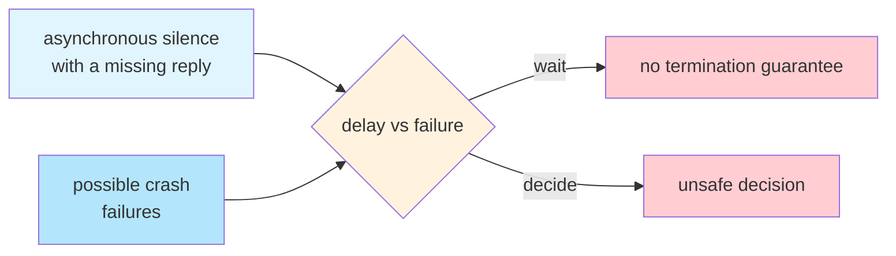
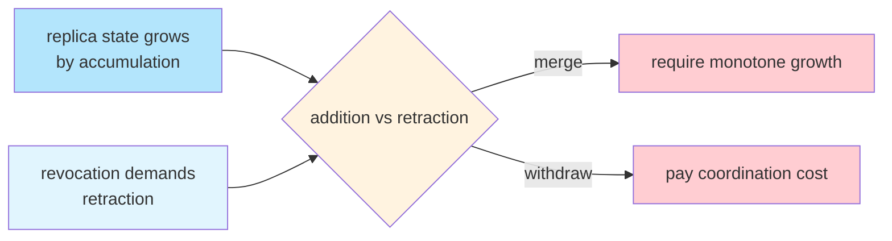
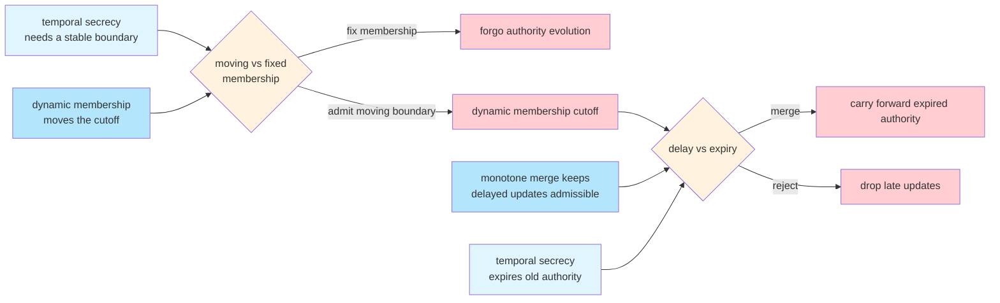

+++
title = "Triangle of Forgetting"
date = 2025-04-20
description = "No protocol can guarantee monotone merge, temporal secrecy, and dynamic membership at once. The triangle of forgetting appears when a distributed system cannot tell whether a late update has expired or remains live."
slug = "triangle-of-forgetting"
draft = false

[extra]
cover_image = "/images/triangle-of-forgetting.png"
cover_caption = "Source: <em>Triangle of Sadness</em> (2022) promotional materials."
+++

All distributed systems choose what to remember and what to forget. When memory lives in one place, something can be forgotten by simple deletion. When spread across nodes with different views of the past, forgetting becomes a coordination problem.

This post takes up the problem in the context of causal group key agreement. CGKA is the core primitive in secure group messaging protocols that operate over unordered networks, where updates arrive late and state converges gradually. Either an update is admitted into shared state and remembered, or treated as expired and forgotten. Convergence and expiry pull in different directions, which necessarily promotes the semantics of forgetting into the core protocol.

## A trilemma

Temporal secrecy, monotone convergence, and dynamic membership cannot be jointly guaranteed ([Lean formalization](https://github.com/hxrts/telltale/tree/main/lean/Distributed/Families/TriangleOfForgetting)).

- *Temporal secrecy* is the combined requirement of forward secrecy and post-compromise security. Retired keys must stop decrypting, and compromised state must eventually heal.
- *Monotone merge* lets replicas can absorb updates out of order and still converge without retracting prior state.
- *Dynamic membership* allows authority within the group to evolve through joins and leaves.

A conflict appears when the system must draw a clean cutoff between live and expired updates for the group. Late updates are admitted by monotone merge, but temporal secrecy requires the rejection of updates that were once admissible.

<svg xmlns="http://www.w3.org/2000/svg" viewBox="0 0 500 270" class="triangle-diagram" style="display: block; margin: 0 auto; max-width: 500px; width: 100%; height: auto;">
  <defs>
    <marker id="tof-arrow" viewBox="0 0 10 10" refX="8" refY="5" markerWidth="5" markerHeight="5" orient="auto-start-reverse">
      <path d="M 0 0 L 10 5 L 0 10 z" fill="currentColor"/>
    </marker>
  </defs>
  <g stroke-width="1.5" fill="none">
    <line x1="225" y1="65" x2="135" y2="200" marker-start="url(#tof-arrow)" marker-end="url(#tof-arrow)"/>
    <line x1="275" y1="65" x2="365" y2="200" marker-start="url(#tof-arrow)" marker-end="url(#tof-arrow)"/>
    <line x1="185" y1="227" x2="315" y2="227" marker-start="url(#tof-arrow)" marker-end="url(#tof-arrow)"/>
  </g>
  <g font-family="var(--font-sans)" font-size="15">
    <rect class="tof-convergence" x="150" y="10" width="200" height="55" stroke-width="1"/>
    <text x="250" y="38" text-anchor="middle" dominant-baseline="middle" fill="currentColor">Monotone Merge</text>
    <rect class="tof-secrecy" x="5" y="200" width="180" height="55" stroke-width="1"/>
    <text x="95" y="228" text-anchor="middle" dominant-baseline="middle" fill="currentColor">Temporal Secrecy</text>
    <rect class="tof-membership" x="315" y="200" width="180" height="55" stroke-width="1"/>
    <text x="405" y="228" text-anchor="middle" dominant-baseline="middle" fill="currentColor">Dynamic Membership</text>
  </g>
</svg>

## Memory horizon

A distinction between live and expired updates is what makes collective forgetting possible. At some point updates must cease to count as live, otherwise recovery from key exposure will never heal and revocation never completes. Any system that promises to forget must therefore specify a cutoff.

Clock time can supply a timeout, but not an escape hatch. A TTL replaces a protocol-history cutoff with a synchrony assumption, since replicas must trust that their clocks and delivery delays are sufficiently bounded to classify each update consistently.

## Ordering is not agreement

A logical clock supplies ordering discipline, allowing replicas to observe a cutoff. What it does not provide is agreement. Two replicas may stand on different sides of the same cutoff, while each remains locally coherent. One observes an update that changes the boundary, the other still admits an earlier update as live.

The problem appears when admission depends on what the local observer can see. At that point, local indistinguishability begins to constrain the protocol itself.

## Dynamic membership makes matters worse

Membership changes define many of the cutoffs the system cares about, since removing a member means their keys must stop working. Yet membership changes are themselves ordinary updates, and they propagate with the same delay as any other message on the network. In MLS, for example, an update or removal only takes effect for other members once the relevant commit is processed.

Different nodes therefore disagree about who belongs to the group and about whether a cutoff has already happened. One node may treat an update as live while another treats that same update as expired. The question of who may speak becomes the question of which speach still counts.

## Building intuition

With the problem now in full view, it helps to place the Triangle of Forgetting beside two established distributed systems results, FLP Impossibility and Consistency as Logical Monotonicity (CALM). Even though their setup is distinct, a comparison will clarify the key tradeoffs.

### FLP Impossibility

When delay and failure are indistinguishable, a node does not know when it is safe to decide. A protocol that decides too early risks violating safety. A protocol that waits for certainty may do so indefinitely. Our problem lives in a broader setting, but also inherits a shape where boundary uncertainty forces a costly choice.

### CALM

For purely additive systems, coordination is altogether avoidable. Coordination is a consequence of retraction. Shapiro's work on Conflict-free Replicated Data Types gives this principle a concrete distributed form. Tombstones can encode removal without breaking monotone merge, but they do not by themselves solve the question of when obsolete authority can stop counting. Our setting includes monotone distributed replication, but temporal secrecy necessarily introduces distributed programs in which previously admissible conclusions may later become inadmissible.

### Triangle of Forgetting

Our setting touches both concerns. Monotone merge wants durable mergeability, while temporal secrecy and dynamic membership together turn revocation into a moving problem of authority.

The ambiguity here is the late-versus-invalid ambiguity from the formal result. In protocol terms, it appears as uncertainty about whether an update is simply late or whether it has already expired. Reconciling those two possibilities requires a commitment the local node is never in a position to make alone.

The trilemma can be paid in three ways:
1. Relax temporal secrecy by allowing expired authority to continue past the intended cutoff.
2. Relax monotone convergence by rejecting late updates that would otherwise merge.
3. Relax dynamic membership by fixing the group boundary instead of letting authority evolve.

## The path to compromise

MLS was designed to make secure group messaging more accessible through flexible async group chats with strong forward secrecy and post-compromise security. TreeKEM, and later CGKA, made this a distributed problem. The Triangle of Forgetting names the tension among these implied design objectives: secrecy should heal over time, delayed updates should converge across replicas, membership should evolve. Completing the triangle is impossible, forgetting is the cost of compromise.

## References

- Alwen, J., Coretti, S., Jost, D., & Mularczyk, M. (2020). [Continuous Group Key Agreement with Active Security](https://eprint.iacr.org/2020/752). *CRYPTO 2020*.
- Fischer, M. J., Lynch, N. A., & Paterson, M. S. (1985). [Impossibility of distributed consensus with one faulty process](https://dl.acm.org/doi/10.1145/3149.214121). *Journal of the ACM*, 32(2), 374–382.
- Hellerstein, J. M., & Alvaro, P. (2020). [Keeping CALM: When Distributed Consistency is Easy](https://cacm.acm.org/research/keeping-calm/). *Communications of the ACM*, 63(9), 72–81. Preprint: [arXiv:1901.01930](https://arxiv.org/abs/1901.01930).
- Rescorla, E., et al. (2023). [RFC 9420: The Messaging Layer Security (MLS) Protocol](https://www.rfc-editor.org/rfc/rfc9420.html).
- Shapiro, M., Preguica, N., Baquero, C., & Zawirski, M. (2011). [Conflict-free replicated data types](https://arxiv.org/abs/1805.06358). In *Stabilization, Safety, and Security of Distributed Systems*.
