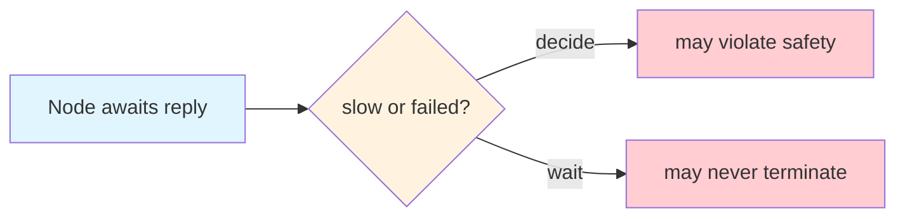
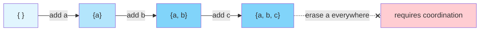

+++
title = "Triangle of Forgetting"
date = 2025-01-09
description = "No protocol can guarantee monotone merge, temporal secrecy, and dynamic membership at once. The triangle of forgetting appears when a distributed system cannot tell whether a late update is still live or already expired."
slug = "triangle-of-forgetting"
draft = false

[extra]
cover_image = "/images/triangle-of-forgetting.png"
cover_caption = "Borrowed from <em>Triangle of Sadness</em> (2022) promotional materials."
+++

All distributed systems choose what to remember and what to forget. When memory lives in one place, something can be forgotten by simple deletion. When spread across nodes with different views of the past, forgetting becomes a coordination problem.

This post takes up this problem in the context of designing protocols for causal group key agreement (CGKA). Such protocols aim to operate over unordered networks, where updates arrive late and state converges gradually. Updates are either admitted into shared state and remembered, or treated as expired and forgotten.

Convergence and expiry pull in different directions. That tension turns forgetting into a decision about updates: which ones the system continues to admit, and which ones it must reject as expired.

## No free lunch

Three properties are in play: monotone merge, temporal secrecy, and dynamic membership. Here temporal secrecy names the joint requirement of forward secrecy and post-compromise security, so retired keys must no longer decrypt and compromised state must eventually heal. Monotone merge means replicas can absorb updates out of order and still converge through a monotone join discipline. Dynamic membership means the system supports both joins and leaves.

Taken together these three properties do not compose cleanly. Any two can be satisfied with moderate machinery, but the third demands extra structure. The conflict surfaces the moment we try to define a clean cutoff between live and expired updates. Monotone merge wants prior evidence to remain mergeable, while temporal secrecy wants some once-live evidence to become inert.

## Forgetting requires a time horizon

Temporal secrecy is, in essence, a rule about time. After some designated point, an update is no longer live, and without such a point compromise never fully heals. Every system that claims temporal secrecy must define a horizon, whether it speaks in epochs, commits, or some other logical progression.

Wall-clock time is poorly suited to this work, because clocks drift across nodes and partitioned peers may disagree. A logical notion of progress is therefore the natural choice.

## Ordering is not agreement

A logical clock supplies an ordering discipline. It lets us say that one observed event followed another, and it can support protocol notions such as epochs or cutoffs that advance without reference to wall time. Lamport's 1978 construction was designed to offer precisely this weaker service, which is order without a shared physical clock.

What it does not provide is agreement. A Lamport timestamp orders events that have been seen, but it does not certify that every causally prior event has already arrived, nor that every node has crossed the same boundary. If one node has observed E and another has not, then the first may treat a preceding update as expired while the second continues to treat that same update as live. Both positions are locally coherent.

A logical cutoff therefore remains local until some stronger shared structure makes it global. The contradiction bites when admission is determined from what the local observer can see, because indistinguishable local views then force the same accept or reject decision. FLP and CRDT monotone merge matter here by analogy, not because they prove this result directly, but because they teach the same lesson: agreement about a boundary is a harder service than local ordering inside an asynchronous network.

## Dynamic membership makes matters worse

Membership changes define many of the cutoffs the system cares about, since removing a member means her keys must stop working. Yet membership changes are themselves ordinary updates, and they propagate with the same delay as any other message on the network. In MLS, for example, an Update or Remove only takes effect for other members once the relevant Commit is processed.

Different nodes therefore disagree about who belongs to the group and about whether a cutoff has already happened. Liveness itself begins to diverge rather than merely lag, and the question of who may speak folds into the question of whose speech still counts.

## The bargain

You can merge forever, or you can forget cleanly. To do both, you must agree on when forgetting happens, and everything else is a way of paying for that agreement.

There are only a few ways to pay. You can reject updates strictly once they expire, which preserves temporal secrecy at the expense of monotone merge until nodes catch up. You can instead accept updates for longer, which preserves monotone merge at the expense of prolonged key validity. Or you can coordinate the cutoff through shared structure, which restores agreement at the cost of the very asynchrony the system was meant to tolerate.

Real systems stake out positions along this spectrum. Some favor monotone merge, letting evidence accumulate under causal structure and treating update liveness as local until the system converges. This suits harsh networks but leaves the moment of forgetting blurred. Others favor canonical state, defining cutoffs through shared journal state and restoring a crisp boundary at the price of stronger coordination.

---

## Addendum: Relationship to Classic Results

The problem described above sits alongside several well-known results in distributed systems. Although they arise from the same underlying tension, they are distinct.

All of these results descend from a single source, which is the limited information available to a node in an asynchronous system. Such a node cannot reliably know what has happened elsewhere, and it cannot tell whether a missing message is delayed, absent, or simply on the way. This epistemic poverty forces tradeoffs that better-informed systems would never face.

### FLP Impossibility

The celebrated 1985 result of Fischer, Lynch, and Paterson concerns consensus. In a fully asynchronous system with even one crash failure, they showed that no deterministic protocol can guarantee termination while preserving agreement and validity. The ambiguity is between slow and failed, since no node can distinguish a delayed peer from a dead one, and so no node can know when it is safe to force a decision.

### CRDT Monotone Merge

Shapiro's work on Conflict-free Replicated Data Types supplies the positive companion to FLP in the narrower setting that matters here. Replica state can converge without coordination when updates accumulate through a monotone join discipline. Each new fact extends rather than retracts what the system already knows.

This does not mean CRDTs cannot model removal. They often do so by adding evidence such as tombstones or causal certificates. What monotonicity does not give for free is clean revocation, where old authority ceases to count and obsolete evidence can be discarded everywhere without further agreement.

### Triangle of Forgetting

Our setting combines concerns from both precursors. The monotone merge vertex comes straight from CRDTs, while temporal secrecy and dynamic membership together turn revocation into a moving problem of authority. Each pulls against the others: monotone merge wants durable mergeability, revocation wants authority to end, and support for joins and leaves keeps changing the rule by which either judgment is made.

The ambiguity here is the late-versus-invalid ambiguity from the formal result. In protocol terms, it appears as uncertainty about whether an update is simply late or whether it has already expired. Reconciling those two possibilities requires a commitment the local node is never in a position to make alone.

<svg xmlns="http://www.w3.org/2000/svg" viewBox="0 0 500 270" class="triangle-diagram" style="display: block; margin: 0 auto; max-width: 500px; width: 100%; height: auto;">
  <defs>
    <marker id="tof-arrow" viewBox="0 0 10 10" refX="8" refY="5" markerWidth="5" markerHeight="5" orient="auto-start-reverse">
      <path d="M 0 0 L 10 5 L 0 10 z" fill="currentColor"/>
    </marker>
  </defs>
  <g stroke-width="1.5" fill="none">
    <line x1="225" y1="70" x2="135" y2="200" marker-start="url(#tof-arrow)" marker-end="url(#tof-arrow)"/>
    <line x1="275" y1="70" x2="365" y2="200" marker-start="url(#tof-arrow)" marker-end="url(#tof-arrow)"/>
    <line x1="185" y1="227" x2="315" y2="227" marker-start="url(#tof-arrow)" marker-end="url(#tof-arrow)"/>
  </g>
  <g font-family="var(--font-sans)" font-size="15">
    <rect class="tof-convergence" x="150" y="15" width="200" height="55" stroke-width="1"/>
    <text x="250" y="43" text-anchor="middle" dominant-baseline="middle" fill="currentColor">Monotone merge</text>
    <rect class="tof-secrecy" x="5" y="200" width="180" height="55" stroke-width="1"/>
    <text x="95" y="228" text-anchor="middle" dominant-baseline="middle" fill="currentColor">Temporal Secrecy</text>
    <rect class="tof-membership" x="315" y="200" width="180" height="55" stroke-width="1"/>
    <text x="405" y="228" text-anchor="middle" dominant-baseline="middle" fill="currentColor">Dynamic Membership</text>
  </g>
</svg>

### What each forces

All three problems have a common shape. Each features a boundary that nodes do not agree on, and in each the system must act before the disagreement resolves. What each forces, however, differs.

FLP and CRDT monotone merge concern operational tradeoffs that surface at runtime. The triangle of forgetting concerns update liveness over evolving state, and what it forces is a rule for when keys, members, and updates cease to count.

| Problem                | What is ambiguous    | What must be chosen      |
| ---------------------- | -------------------- | ------------------------ |
| FLP Impossibility      | delay vs failure     | decide or wait           |
| CRDT Monotone Merge    | growth vs erasure    | accumulate or coordinate |
| Triangle of Forgetting | delay vs expiry      | merge or reject          |

The Triangle of Forgetting is a sibling to known results. It states that if a system cannot distinguish between a late update and an expired one, it must choose: remember or forget.

## References

- Fischer, M. J., Lynch, N. A., & Paterson, M. S. (1985). [Impossibility of distributed consensus with one faulty process](https://dl.acm.org/doi/10.1145/3149.214121). *Journal of the ACM*, 32(2), 374–382.
- Lamport, L. (1978). [Time, clocks, and the ordering of events in a distributed system](https://lamport.azurewebsites.net/pubs/time-clocks.pdf). *Communications of the ACM*, 21(7), 558–565.
- Rescorla, E., et al. (2023). [RFC 9420: The Messaging Layer Security (MLS) Protocol](https://www.rfc-editor.org/rfc/rfc9420.html).
- Rescorla, E., et al. (2025). [RFC 9750: The Messaging Layer Security (MLS) Architecture](https://www.rfc-editor.org/rfc/rfc9750.html).
- Shapiro, M., Preguica, N., Baquero, C., & Zawirski, M. (2011). [Conflict-free replicated data types](https://pages.lip6.fr/Marc.Shapiro/papers/CRDTs_SSS-2011.pdf). In *Stabilization, Safety, and Security of Distributed Systems*.
- Hellerstein, J. M., & Alvaro, P. (2020). [Keeping CALM: When Distributed Consistency is Easy](https://cacm.acm.org/research/keeping-calm/). *Communications of the ACM*, 63(9), 72–81. Preprint: [arXiv:1901.01930](https://arxiv.org/abs/1901.01930).
- Alwen, J., Coretti, S., Jost, D., & Mularczyk, M. (2020). [Continuous Group Key Agreement with Active Security](https://eprint.iacr.org/2020/752). *CRYPTO 2020*.
