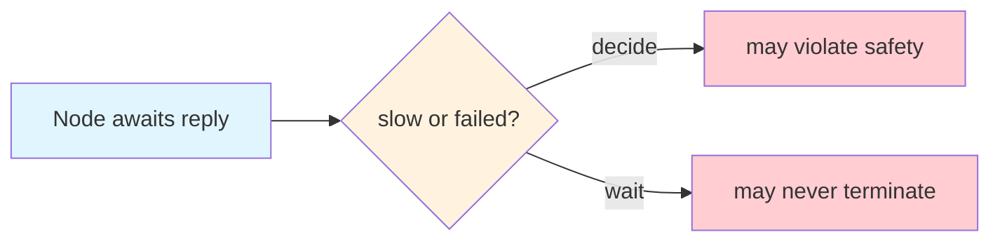
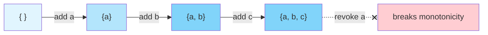

+++
title = "Triangle of Forgetting"
date = 2025-01-09
description = "Causal group messaging cannot simultaneously converge, revoke, and admit. This sibling of FLP and CAP emerges when asking a distributed system to forget."
slug = "triangle-of-forgetting"
draft = false

[extra]
cover_image = "/images/triangle-of-forgetting.png"
cover_caption = "Credit: <em>Triangle of Sadness</em> (2022) promotional materials."
+++

All distributed systems choose what to remember and what to forget. When memory lives in one place, something can be forgotten by simple deletion. When spread across nodes with different views of the past, fogretting becomes a coordination problem.

This post takes up this problem in the context of designing protocols for causal group key agreement (CGKA). Such protocols aim to operate over unordered networks, where messages arrive late and state converges only gradually. CGKAs also promise "temporal secrecy," the combination of forward secrecy and post-compromise security. Retired keys must no longer decrypt, and future sessions must be safe from past compromise. Convergence and temporal secrecy pull in different directions, raising the question: what does it mean for a distributed system to forget?

## No free lunch

Three properties are in play: monotone merge (CRDT-style eventual convergence), temporal secrecy, and dynamic membership. Monotone merge holds that updates can be folded in out of order without coordination, temporal secrecy holds that old state must eventually stop being usable, and dynamic membership holds that the set of legitimate participants keeps changing over time.

Taken together these three properties do not compose. Any two can be satisfied with moderate machinery, but the third always demands extra structure. The conflict surfaces the moment we try to define a clean cutoff between valid and invalid state. Monotone merge wants the past to remain reachable, while temporal secrecy wants it to be gone.

## Forgetting requires a time horizon

Temporal secrecy is, in essence, a rule about time. After some designated point, old state is no longer valid, and without such a point compromise never fully heals. Every system that claims temporal secrecy must define a time horizon.

Wall-clock time is not fit for purpose, because clocks drift across nodes and partitioned peers may disagree. A logical clock is therefore the natural choice.

## Ordering is not agreement

A logical clock supplies ordering. It lets us say with confidence that event E happened after event D, and it lets us mark everything preceding E as old. Lamport's 1978 construction was designed to offer precisely this service, and it removes any residual dependence on real time.

What it does not provide is agreement. If one node has observed E and another has not, then the first treats the preceding state as invalid while the second continues to treat that same state as live. Both positions are locally correct. A logical clock defines the cutoff without making the cutoff global, and global agreement, as FLP and CAP have reminded us for decades, is a strictly harder service.

## Dynamic membership makes matters worse

Membership changes define many of the cutoffs the system cares about, since removing a member means her keys must stop working. Yet membership changes are themselves ordinary updates, and they propagate with the same delay as any other message on the network.

Different nodes therefore disagree about who belongs to the group and about whether a cutoff has already happened. Validity itself begins to diverge rather than merely lag, and the question of who may speak becomes indistinguishable from the question of whose speech still counts.

## The bargain

You can merge forever, or you can forget cleanly. To do both, you must agree on when forgetting happens, and everything else is a way of paying for that agreement.

There are only a few ways to pay. You can reject old updates strictly, which preserves temporal secrecy at the expense of monotone merge until nodes catch up. You can instead accept old updates for longer, which preserves monotone merge at the expense of prolonged key validity. Or you can coordinate the cutoff through shared structure, which restores agreement at the cost of the very asynchrony the system was meant to tolerate.

Real systems stake out positions along this spectrum. Some favor monotone merge, letting updates accumulate under causal structure and treating validity as local until the system converges. This suits harsh networks but leaves the moment of forgetting blurred. Others favor canonical state, defining cutoffs through shared journal state and restoring a crisp boundary at the price of structural commitments.

---

## Addendum: Relationship to Classic Impossibility Results

The problem described above sits alongside several well-known impossibility results in distributed systems. Although they arise from the same underlying tension, they are distinct.

All of these results descend from a single source, which is the limited information available to a node in an asynchronous system. Such a node cannot reliably know what has happened elsewhere, and it cannot tell whether a missing message is delayed, absent, or simply on the way. This epistemic poverty forces tradeoffs that better-informed systems would never face.

### FLP Impossibility

The celebrated 1985 result of Fischer, Lynch, and Paterson concerns consensus. In a fully asynchronous system with even one faulty process, they showed, no protocol can guarantee that all nodes eventually decide. The ambiguity is between slow and failed, since no node can distinguish a delayed peer from a dead one, and so no node can safely commit to a value.

### CAP Theorem

Brewer's CAP conjecture, later formalized by Gilbert and Lynch, concerns replicated data under partition. During a partition, no replicated store can offer both strong consistency and full availability. The ambiguity here is between partition and delay, because a node facing silence cannot tell whether its peer is unreachable or merely slow.

<svg xmlns="http://www.w3.org/2000/svg" viewBox="0 0 500 270" class="triangle-diagram" style="display: block; margin: 0 auto; max-width: 500px; width: 100%; height: auto;">
  <defs>
    <marker id="cap-arrow" viewBox="0 0 10 10" refX="8" refY="5" markerWidth="5" markerHeight="5" orient="auto-start-reverse">
      <path d="M 0 0 L 10 5 L 0 10 z" fill="currentColor"/>
    </marker>
  </defs>
  <g stroke-width="1.5" fill="none">
    <line x1="225" y1="70" x2="135" y2="200" marker-start="url(#cap-arrow)" marker-end="url(#cap-arrow)"/>
    <line x1="275" y1="70" x2="365" y2="200" marker-start="url(#cap-arrow)" marker-end="url(#cap-arrow)"/>
    <line x1="185" y1="227" x2="315" y2="227" marker-start="url(#cap-arrow)" marker-end="url(#cap-arrow)"/>
  </g>
  <g font-family="var(--font-sans)" font-size="15">
    <rect class="tof-convergence" x="150" y="15" width="200" height="55" stroke-width="1"/>
    <text x="250" y="43" text-anchor="middle" dominant-baseline="middle" fill="currentColor">Consistency</text>
    <rect class="tof-membership" x="5" y="200" width="180" height="55" stroke-width="1"/>
    <text x="95" y="228" text-anchor="middle" dominant-baseline="middle" fill="currentColor">Availability</text>
    <rect class="tof-secrecy" x="315" y="200" width="180" height="55" stroke-width="1"/>
    <text x="405" y="228" text-anchor="middle" dominant-baseline="middle" fill="currentColor">Partition Tolerance</text>
  </g>
</svg>

### CRDT Monotonicity

Shapiro's work on Conflict-free Replicated Data Types, together with Hellerstein's CALM theorem, supplies the positive companion to FLP and CAP. A system converges across replicas without coordination exactly when its operations are monotonic. The lattice can only grow.

The ambiguity this introduces is between growth and revocation. Monotone joins can record additions but cannot represent withdrawals, and so revocation demands coordination of a kind CRDTs alone cannot provide.

### Triangle of Forgetting

Our setting combines concerns from all three precursors. The monotone merge vertex comes straight from CRDTs, temporal secrecy from revocation, and dynamic membership from evolving authority. Each pulls against the others: monotone merge wants to keep growing, revocation wants to cut things off, and membership keeps changing the rules for both.

The ambiguity here is between delayed and invalid. A node cannot tell whether an old update is simply late or whether it should be rejected outright, and reconciling the two requires a commitment the local node is never in a position to make alone.

<svg xmlns="http://www.w3.org/2000/svg" viewBox="0 0 500 270" class="triangle-diagram" style="display: block; margin: 0 auto; max-width: 500px; width: 100%; height: auto;">
  <defs>
    <marker id="tof-arrow" viewBox="0 0 10 10" refX="8" refY="5" markerWidth="5" markerHeight="5" orient="auto-start-reverse">
      <path d="M 0 0 L 10 5 L 0 10 z" fill="currentColor"/>
    </marker>
  </defs>
  <g stroke-width="1.5" fill="none">
    <line x1="225" y1="70" x2="135" y2="200" marker-start="url(#tof-arrow)" marker-end="url(#tof-arrow)"/>
    <line x1="275" y1="70" x2="365" y2="200" marker-start="url(#tof-arrow)" marker-end="url(#tof-arrow)"/>
    <line x1="185" y1="227" x2="315" y2="227" marker-start="url(#tof-arrow)" marker-end="url(#tof-arrow)"/>
  </g>
  <g font-family="var(--font-sans)" font-size="15">
    <rect class="tof-convergence" x="150" y="15" width="200" height="55" stroke-width="1"/>
    <text x="250" y="43" text-anchor="middle" dominant-baseline="middle" fill="currentColor">Monotone merge</text>
    <rect class="tof-secrecy" x="5" y="200" width="180" height="55" stroke-width="1"/>
    <text x="95" y="228" text-anchor="middle" dominant-baseline="middle" fill="currentColor">Temporal Secrecy</text>
    <rect class="tof-membership" x="315" y="200" width="180" height="55" stroke-width="1"/>
    <text x="405" y="228" text-anchor="middle" dominant-baseline="middle" fill="currentColor">Dynamic Membership</text>
  </g>
</svg>

### What each forces

All four problems share a common shape. Each features a boundary that nodes do not agree on, and in each the system must act before the disagreement resolves. What each forces, however, differs.

FLP, CAP, and the CRDT result concern operational tradeoffs that surface at runtime. The triangle of forgetting concerns validity itself, and what it forces is a semantic rule about when state stops being valid, a rule that governs all future behavior.

| Problem                | What is ambiguous    | What must be chosen   |
| ---------------------- | -------------------- | --------------------- |
| FLP Impossibility      | delay vs failure      | decide or wait        |
| CAP Theorem            | delay vs partition    | respond or block      |
| CRDT Monotonicity      | growth vs revocation  | accrete or coordinate |
| Triangle of Forgetting | delay vs invalidation | merge or reject       |

The Triangle of Forgetting is a sibling to known results. It states if system cannot distinguish between late and expired, it must choose: remember or forget.

## References

- Fischer, M. J., Lynch, N. A., & Paterson, M. S. (1985). [Impossibility of distributed consensus with one faulty process](https://dl.acm.org/doi/10.1145/3149.214121). *Journal of the ACM*, 32(2), 374–382.
- Gilbert, S., & Lynch, N. (2002). [Brewer's conjecture and the feasibility of consistent, available, partition-tolerant web services](https://dl.acm.org/doi/10.1145/564585.564601). *ACM SIGACT News*, 33(2), 51–59.
- Hellerstein, J. M., & Alvaro, P. (2020). [Keeping CALM: When Distributed Consistency is Easy](https://cacm.acm.org/research/keeping-calm/). *Communications of the ACM*, 63(9), 72–81. Preprint: [arXiv:1901.01930](https://arxiv.org/abs/1901.01930).
